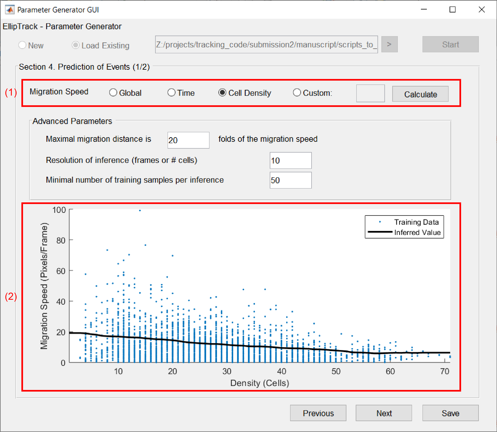
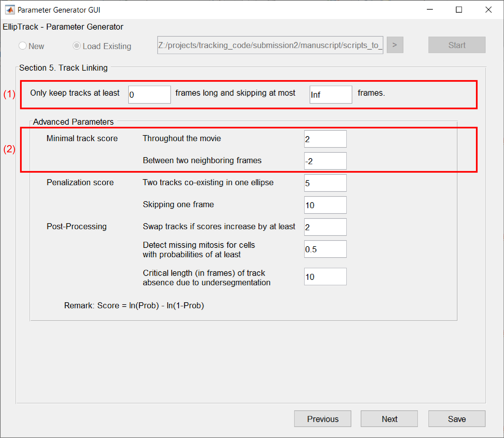

.. _GUI_parameter_Page:

=======================
Parameter Generator GUI
=======================

Open GUI
========

Navigate MATLAB to the *GUI* folder. Execute ``parameter_generator_gui`` in the command window.

Load Parameters
===============

Select "New" to load the default parameter values. 
To load an existing parameter file, select "Load Existing" and then locate the file. 
Click "Start" to import the parameter values.

Movie Definition (*movie_definition*)
=====================================

Panel 1
*******

1. Select the movie format.
2. Select the number of channels.
3. Channel-specific information.

   *  **Channel** --- Name of the fluorescence channel. 
   
      The first channel should image cell nuclei. Images of this channel will be used for Segmentation and Track Linking. Images of the other channels will be used for Signal Extraction.
   
   *  **Signal** --- Name of the signal to measure.
   *  **Image Path** --- Path to the folder storing the images. Check "Same" if the images of all channels locate in the same folder.

      For Nikon ND2 format, click ">" of the nuclear channel and a new GUI pops up. Users may edit and arrange the order of folders.
      
      .. figure:: _static/images/parameter/1_1_extra.png
         :align: center
         :width: 300

   *  **Illumination Bias** --- Optional. Path to the MAT file storing the illumination bias. Leave empty if not available.
   *  **Calc Cytoring?** --- Check to calculate the signals in the cytoplasmic ring.

4. Format of image filenames. 

   Specify the full filenames for image sequences and stacks, and a filename prefix for the Nikon ND2 format.
   Click the buttons below to add variable information (e.g. Row ID, Channel Name). Click "Check Filename" to examine whether the format meets expectation.

   .. admonition:: Example
      :class: hint

      **Example 1 (Image Sequences)**. Filenames follow the convention `RowID_ColumnID_SiteID_ChannelName_FrameID.tif`. Frame ID having three digits. For example, `1_2_3_CFP_004.tif`.

      Follow the steps below to specify the format.

      *  Add Row ID: Click "Add Row ID", click "Numeric ID", and type "1" in the pop-up text box. 

         Current format: ``%r``

      *  Add "_" between Row ID and Column ID: Type "_" in the text box.

         Current format: ``%r_``

      *  Add Column ID: Click "Add Column ID", and type "1" in the pop-up text box.

         Current format: ``%r_%c``

      *  Add "_" between Column ID and Site ID: Type "_" in the text box.

         Current format: ``%r_%c_``
      
      *  Add Site ID: Click "Add Site ID", and type "1" in the pop-up text box.

         Current format: ``%r_%c_%s``
      
      *  Add "_" between Site ID and Channel Name: Type "_" in the text box.

         Current format: ``%r_%c_%s_``

      *  Add Channel Name: Click "Add Channel", and click "Channel Name"

         Current format: ``%r_%c_%s_%n``

      *  Add "_" between Channel Name and Frame ID: Type "_" in the text box.

         Current format: ``%r_%c_%s_%n_``

      *  Add Frame ID: Click "Add Frame ID", and type "3" (for 3 digits) in the pop-up text box.

         Current format: ``%r_%c_%s_%n_%03t``

      *  Add file extension: Type ".tif" in the text box.

         Current format: ``%r_%c_%s_%n_%03t.tif``

      *  Examine the correctness: Click "Check Filename".

         Input format meets expectation, as shown in the following message box.

         .. figure:: _static/images/parameter/filename_1.png
            :align: center
            :width: 300

      **Example 2 (Nikon ND2 Format)**. Filenames follow the convention `WellRowIDColumnID_CFP,YFP,mCherry_Seq00XX.nd2`. Row ID is an upper-case letter; Column ID is a two-digit number; and *XX* represents an arbitrary number. For example, `WellA02_CFP,YFP,mCherry_Seq0001.nd2`.
      
      Follow the steps below to specify the format.

      *  Add prefix "Well": Type "Well" in the text box.

         Current format: ``Well``

      *  Add Row ID: Click "Add Row ID", and click "Letter ID (Upper)". 

         Current format: ``Well%b``

      *  Add Column ID: Click "Add Column ID", and type "2" (for 2 digits) in the pop-up text box.

         Current format: ``Well%b%02c``;

      *  Examine the correctness: Click "Check Filename".

         Input format meets expectation, as shown in the following message box.

         .. figure:: _static/images/parameter/filename_2.png
            :align: center
            :width: 300

Panel 2
*******

1. Movie Coordinate and Frame ID --- Check "Not Multi-Well Plate" if movies are not captured on a multi-well plate. Frame ID can start with 0.
2. Camera dark noises (CMOS Offset) --- Optional. Path to the MAT file storing the camera dark noises. Leave empty if not available.
3. Method of Jitter Correction

   .. list-table::
      :widths: 1 2 2
      :header-rows: 1

      * - Option
        - Description
        - Suggested Situation
      * - 'none'
        - No Jitter Correction is performed.
        - Jitters are negligible.
      * - 'local'
        - Jitters are calculated from each movie

          independently.
        - Movies are not captured 
        
          on the same multi-well plate. 
      * - 'global'
        - Jitters are calculated from the plate 
        
          motion jointly inferred from all movies.
        - Movies are captured on 
        
          the same multi-well plate. 

          Require at least 6 movies.

4. Extract individual images --- Nikon ND2 format only. For Training Data GUI.

   Type movie information and the destination folder ("Path"), and click "Extract". Only extract the images from which training datasets will be constructed.

Input/Output (*inout_para*)
===========================

1. Training datasets --- Paths to the MAT files storing the training datasets.

   Click "+" or "-" to add or remove training datasets. Leave empty if not available.

2. Outputs --- Paths to the folders storing the outputs.

   Generating "MAT Files" is compulsory. Other outputs are optional. Un-check "Generate?" if not generating this output.

.. list-table::
   :widths: 1 3
   :header-rows: 1

   * - Optional Output
     - Suggested Usage
   * - Mask 
     - Evaluation of segmentation accuracy, before ellipse fitting.
   * - Ellipse Movie
     - Evaluation of segmentation accuracy, after ellipse fitting.
   * - Segmentation Info 
     - Construction of training datasets.
   * - Vistrack Movie
     - Evaluation of track accuracy.

Segmentation (*segmentation_para*)
==================================

1. Image information --- Specify the image to examine, and click "Load Image" to load it into GUI.
2. Range of pixel intensities --- Specify the lower and upper limits for display.

   The default values are the lowest and highest pixel intensities of the imported image. Adjust this range to visualize the dim cell nuclei.

3. Parameters for segmentation.

   Parameters are organized by steps. For each step, edit the parameter values and click "Update" to visualize the result on the left. If satisfactory, click "Next" to go to the next step.
   Users may also switch to any step by clicking the corresponding button.

   .. list-table::
      :widths: 3 3
      :header-rows: 1

      * - Situation
        - Suggested Option
      * - Images have bright backgrounds.
        - * Image Binarization
        
            Bg Sub: Any option but "None".
      * - Accurate nuclear boundaries 
      
          not detected by Image Binarization.
        - Active Contour: Check "Run?"
      * - Nuclei overlap frequently.
        - Watershed: Check "Run?"
      * - Training datasets available and suitable.
        - Correction with Training Data: Check "Run?"
      * - Nuclei have heterogeneous brightness.
        - * Image Binarization
        
            Check "Log-Transform"
             
            Method: Select "Blob Detection"

          * Active Contour
          
            Check "Log-Transform"
             
            Method: Select "Local"

   All the parameters in "Ellipse Fitting" are advanced. It is often unnecessary to modify their values. For "Correction with Training Data", the removed ellipses are colored in blue and the split ellipses are colored in green.

   If error occurs, an error dialog will appear.
   
   .. figure:: _static/images/parameter/3_extra.png
      :align: center
      :width: 300

   GUI will switch to the step with error. Panel on the left will display the result from the previous step, with text "Segmentation Error" on the top left.

   .. figure:: _static/images/parameter/3_extra2.png
      :align: center

4. Segmentation result --- Output of the current step. 

Prediction of Events (*prob_para*)
==================================

Panel 1
*******

1. Method of migration speed inference.

   .. list-table::
      :widths: 1 5
      :header-rows: 1

      * - Option 
        - Description
      * - Global
        - Inference of one migration speed for all cells. 
      * - Time
        - Time-dependent inference of migration speeds. 
      * - Cell Density
        - Local cell density-dependent inference of migration speeds.
      * - Custom
        - A custom migration speed for all cells.

   For the first three options, click "Calculate" to examine the inference result.

2. Inference result.

   For "Global", the migration speeds are visualized in a histogram, and the inferred speed is shown as a vertical line.

   .. figure:: _static/images/parameter/4_1_1.png
      :align: center
      :width: 500

   For "Time" and "Cell Density", the migration speeds are plotted against Frame IDs or the numbers of cells in the local neighborhoods. The inferred speeds are visualized by a black line.

   .. figure:: _static/images/parameter/4_1_2.png
      :align: center
      :width: 500

Panel 2
*******

1. Method of mitosis detection.

   Probabilities of events not being considered are modified to 0.5, such that these events' states do not affect the probability of cell lineages.

2. Method of migration probability calculation.

   For the former option, the migration probability is calculated by

   .. math::
      
        & P\left(D_{i,t}\rightarrow D_{j,t+1}\right) \\
        = & \frac{P_{sim}\left(D_{i,t}, D_{j,t+1}\right) P_{mig}\left(D_{i,t}, D_{j,t+1}\right)}{P_{sim}\left(D_{i,t}, D_{j,t+1}\right) P_{mig}\left(D_{i,t}, D_{j,t+1}\right) + \left[1-P_{sim}\left(D_{i,t}, D_{j,t+1}\right)\right]P_{nonmig}}

   where :math:`D_{i,t}` and :math:`D_{j,t+1}` refer to the i-th ellipse in Frame t and j-th ellipse in Frame t+1, respectively; 
   :math:`P_{sim}\left(D_{i,t}, D_{j,t+1}\right)` is the probability that :math:`D_{i,t}` and :math:`D_{j,t+1}` represent the same cell;
   :math:`P_{mig}\left(D_{i,t}, D_{j,t+1}\right)` is the probability that a cell migrates from the position of :math:`D_{i,t}` to the position of :math:`D_{j,t+1}` by random walk;
   and :math:`P_{nonmig}` is a constant null probability for migration.

   For the latter option, the migration probability equals to :math:`P_{mig}\left(D_{i,t}, D_{j,t+1}\right)`.

Track Linking (*track_para*)
============================

1. Validity of cell tracks.

   Shorter tracks or tracks skipping more frames will be removed. The mitosis events associated with these tracks will be removed as well.

2. Minimal track scores.

   A positive (negative) score indicates that the probability of cell lineages increases (decreases).
   A cell track should have an overall positive score to be added to the cell lineages.
   However, we usually allow a cell track to have a slightly negative score between two neighboring frames, such that tracks with occasional adverse probabilities can still be considered.

Signal Extraction (*signal_extraction_para*)
============================================

1. Definition of regions of interest

   .. list-table::
      :widths: 1 3
      :header-rows: 1

      * - Quantity
        - Distance between the black dash line (ellipse) and ...
      * - Outer, Nucleus
        - Outer boundary of the orange region (nucleus)
      * - Inner, Cyto Ring
        - Inner boundary of the dark green region (cytoplasmic ring) 
      * - Outer, Cyto Ring
        - Outer boundary of the dark green region (cytoplasmic ring)  
      * - Outer, Membrane
        - Outermost point of the light green region (cytoplasm) 

2. Percentiles to measure

   Each percentile should be a number between 0 and 100 (both exclusive). The percentiles should be separated by a space.

Save Parameters
===============

Click "Save" to save the parameter values. File *parameters.m* will appear in the *GUI* folder. Move this file to the main folder of EllipTrack (where *mainfile.m* locates).

