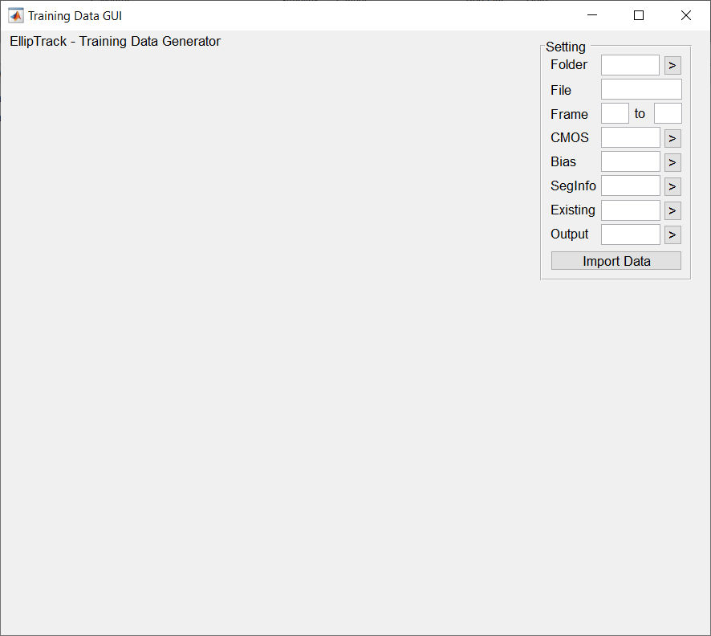
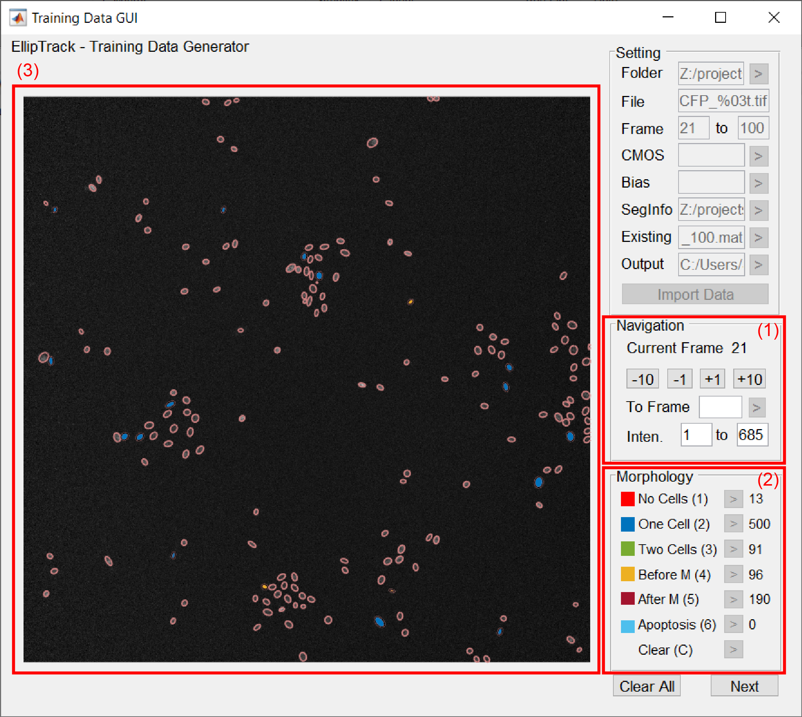
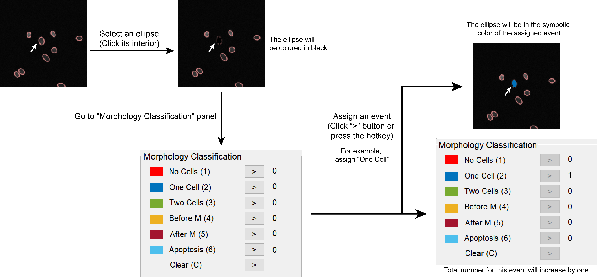
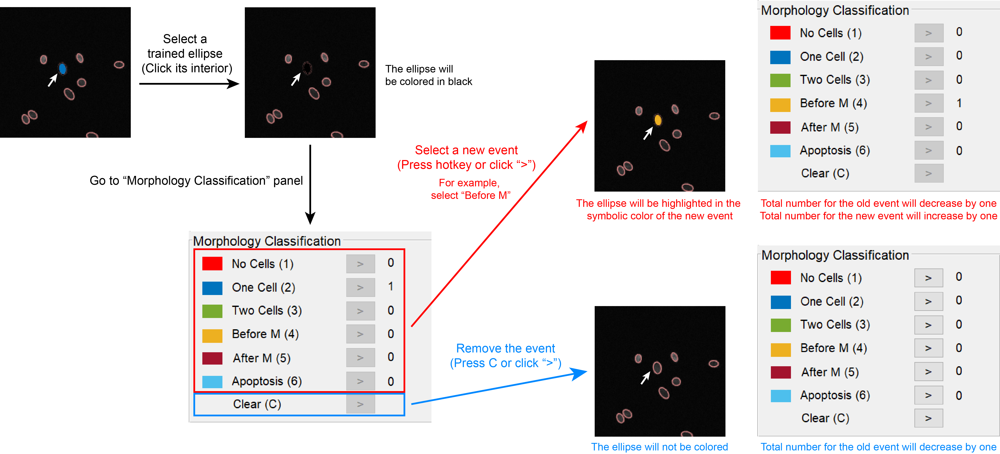
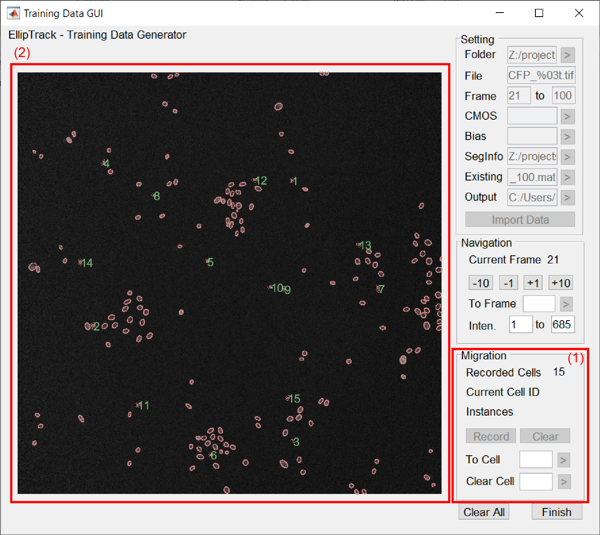
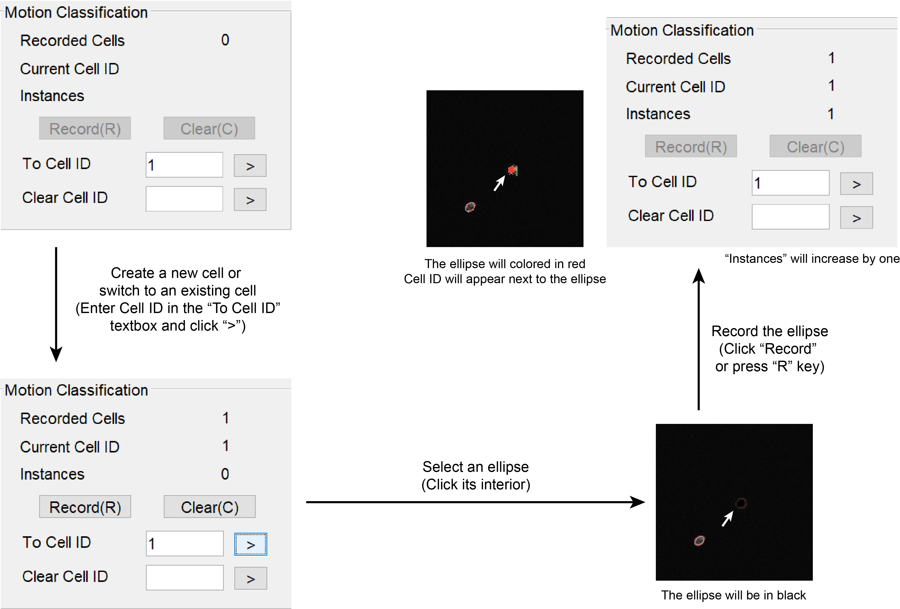
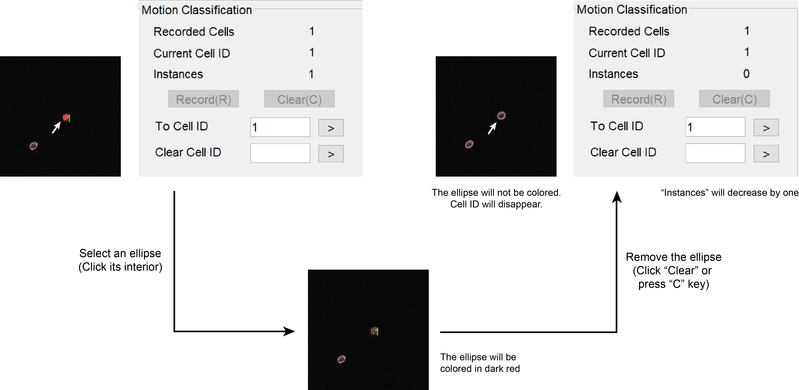

.. include:: .special.rst

.. _GUI_training_Page:

=================
Training Data GUI
=================

Open GUI
========

Navigate MATLAB to the *GUI* folder. Execute ``training_data_gui`` in the command window.

Load Images
===========

Specify the following information in the Setting panel.

  *  **Folder** --- Path to the folder storing images of the nuclear channel.

     Image sequences/stacks only. For Nikon ND2 format, extract movies into image sequences first.

  *  **File** --- Format of image filenames.

     Similar to "Filename" in :ref:`GUI_parameter_Page`. Only Frame ID ("%t") is allowed as variable information.
  
     .. admonition:: Example
        :class: hint

        **Example 1**. Filename follows *2_1_1_CFP_FrameID.tif*. For example, *2_1_1_CFP_4.tif*. Type ``2_1_1_CFP_%t.tif``.

        **Example 2**. Filename follows *tFrameID.tif*. Frame ID has 3 digits. For example, *t001.tif*. Type ``t%03t.tif``.

  *  **Frame** --- Range of Frame IDs to import.
  *  **CMOS** --- Optional. Path to the MAT file storing the camera dark noises. Leave empty if not available.
  *  **Bias** --- Optional. Path to the MAT file storing the illumination bias. Leave empty if not available.
  *  **SegInfo** --- Path to the folder storing "Segmentation Info" of the imported images.
  *  **Existing** --- Optional. Path to the MAT file storing an existing training dataset for the imported images. Leave empty if not available.

     GUI examines whether the inputs of **Folder**, **File**, and **Frames** match the information stored in the existing dataset. A warning dialog will appear if any mismatch is found.

     .. figure:: _static/images/training/1_extra.png
        :align: center
        :width: 300
  *  **Output** --- Path to the folder storing the output. 

Click "Import Data" to proceed.

Morphological Training
======================

Objective: Label cells with representative behaviors.

GUI Interface
*************

1. Navigation of Frames.

   *  **Current Frame** --- Frame ID of the image being displayed in the left panel.
   *  **Switch Frames** --- Switch the image being displayed.

      .. list-table::
         :widths: 1 2
         :header-rows: 1

         * - Option
           - Operation
         * - Forward by 1 Frame
           - Click "+1" button, press right arrow key, 
         
             or scroll down the mouse wheel.
         * - Backward by 1 Frame
           - Click "-1" button, press left arrow key,

             or scroll up the mouse wheel.
         * - Forward by 10 Frames 

           - Click "+10" button, or press up arrow key.
         * - Backward by 10 Frames

           - Click "-10" button, or press down arrow key.

      Alternatively, switch to any image by specifying its Frame ID in the "To Frame" textbox and clicking ">".

   *  **Intensity** --- Range of pixel intensities. Specify the lower and upper limits for display.  

2. Morphology.

   Six events are available. Numbers of recorded ellipses are shown in the last column.

   .. list-table::
      :widths: 1 1 4 1
      :header-rows: 1

      * - Color
        - Event
        - Description
        - Hotkey
      * - :training1:`Red`
        - No Cells
        - Ellipse contains no nucleus.
        - 1
      * - :training2:`Blue`
        - One Cell
        - Ellipse contains one nucleus.
        - 2
      * - :training3:`Green`
        - Two Cells
        - Ellipse contains at least two nuclei.
        - 3
      * - :training4:`Yellow`
        - Before M
        - Mitotic cell. Will divide into two daughter  

          cells in the next frame. 

          Assume ellipse contains one nucleus.
        - 4  
      * - :training5:`Dark Red`
        - After M
        - Newly born cell. Mother cell divided  
          
          in the previous frame. 
          
          Assume ellipse contains one nucleus.
        - 5
      * - :training6:`Light Blue`
        - Apoptosis
        - Apoptotic cell. Will disappear in the next frame.

          Assume ellipse contains one nucleus.
        - 6   

3. Training result.

   Image overlaid by fitted ellipses. Trained ellipses are highlighted in the symbolic colors of their respective events.

Assign Events
*************

To assign an event, click the ellipse of interest, and then press the event's hot key or click its respective ">" button.
The ellipse will be highlighted in the symbolic color of this event, and the number of recorded ellipses for this event will increase by one.

Selected ellipses are colored in black. To unselect an ellipse, click any other ellipse or navigate to other frames. No training samples will be created from the unselected ellipses.

Modify and Remove Events
************************

To modify an event, click the ellipse of interest, and then select a new event.
The ellipse will be highlighted in the symbolic color of the new event. Numbers of recorded ellipses will be adjusted.

To remove an event, click the ellipse of interest, and then press "C" or click the respective ">" button.
The ellipse will not be highlighted, and the number of recorded ellipses for the old event will decrease by one.

Suggested Strategy
******************

A training dataset should be constructed from every representative segment of the movie. For each training dataset, use the following guideline.

.. list-table::
   :widths: 1 3
   :header-rows: 1

   * - Event
     - Suggested # Samples
   * - :training1:`No Cells`
     - ~100, less if over-segmentation is rare.
   * - :training2:`One Cell`
     - 200-400
   * - :training3:`Two Cells`
     - ~100, less if under-segmentation is rare.
   * - :training4:`Before M`
     - As many as possible. Do not label if the cell is under-segmented.
   * - :training5:`After M`
     - As many as possible. Do not label if the cell is under-segmented.
   * - :training6:`Apoptosis`
     - Only label if apoptosis is frequent. 

       Do not label if the cell is under-segmented.

**Minimal Requirement**. Label one ellipse. Can be any event.

Click "Next" to proceed.

Motion Training
===============

Objective: Manually label the subtracks of a few cells.

GUI Interface
*************

1. Migration.

   .. list-table::
      :widths: 1 3
      :header-rows: 1

      * - Entry
        - Description
      * - Recorded Cells
        - Total number of recorded cells.
      * - Current Cell ID
        - ID of the cell being recorded.
      * - "Record" Button  
        - Record a new ellipse for the current cell.
      * - "Clear" Button 
        - Remove a recorded ellipse for the current cell.
      * - To Cell ID
        - Create a new cell or switch to an existing cell.
      * - Clear Cell 
        - Remove all recorded ellipses of a cell.

2. Training result.

   Image overlaid by fitted ellipses. 
   Trained ellipses of the current cell are colored in red. Other trained ellipses are colored in light red.
   Respective Cell IDs are plotted next to the trained ellipses.

Record Cells
************

To create a new cell or switch to an existing cell, type Cell ID in the **To Cell ID** textbox and click ">".
To record an ellipse, click the ellipse of interest, and then press "R" or click "Record" button.
The ellipse will be highlighted in red, and Cell ID will be displayed next to it. The number of instances will increase by one.

Remove Recording
****************

To remove a recorded ellipse, click the ellipse of interest, and then press "C" or click "Clear" button.
The ellipse will not be highlighted, and Cell ID will disappear. The number of instances will decrease by one.

To remove all recorded ellipse for a cell, type Cell ID in the "Clear Cell" textbox and click ">".

Suggested Strategy
******************

A training dataset should be constructed from every representative segment of the movie.
Label 10-15 cells for each training dataset. Use the following guideline.

.. list-table::
   :widths: 3 4
   :header-rows: 1

   * - Situation
     - Suggested Action
   * - Cell is under-segmented.
     - Label the under-segmented ellipse.
   * - Cell is over-segmented.
     - Label one of the over-segmented ellipses.
   * - Cell is not detected.
     - Skip the frame.
   * - Cell undergoes mitosis.
     - Label one of the daughter cell.
   * - Cell undergoes apoptosis.
     - Stop labeling the cell.
   * - Cell moves out of the field of view.
     - Stop labeling the cell.

**Minimal Requirement**. Label 3 cells. 3 ellipses per cell.

Save Training Dataset
=====================

Click "Finish" to finish training. A MAT file called *training_data_FromFrameID_ToFrameID.mat* will be generated in the output folder. *FromFrameID* and *ToFrameID* refer to the first and last imported images.
