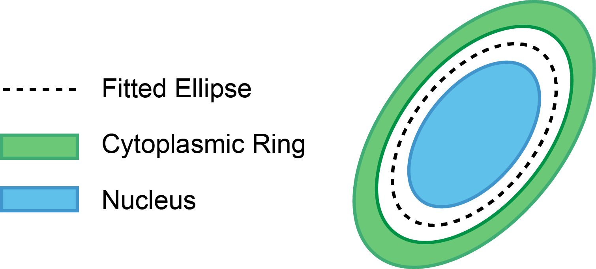

.. include:: .special.rst

.. _parameters_signal_extraction_Page:

============================================
Signal Extraction (*signal_extraction_para*)
============================================

Regions of interest are defined as follows.

.. _para_signal_extraction:

*  :reditalic:`cytoring_region_dist` :gray:`(1x2 integer array)` --- Distances (in pixels) between the cytoplasmic ring and the ellipse contour.

   These two values refer to the inner and outer boundaries of the cytoplasmic ring, respectively.

*  :reditalic:`nuc_region_dist` :gray:`(integer)` --- Distances (in pixels) between the nucleus and the ellipse contour.

*  :reditalic:`background_dist` :gray:`(integer)` --- Distances (in pixels) between the outermost point of cell membrane and the ellipse contour.

*  :reditalic:`intensity_percentile` :gray:`(1xn double array)` --- Percentile of intensities (0 to 100) to measure.

   Each element defines a percentile to measure.

*  :blueitalic:`outlier_percentile` :gray:`(double | advanced parameter)` --- Outlier percentiles (0 to 50) of intensities.

   Upper and lower X% intensities of a region will be discarded from signal calculation.
   