.. include:: .special.rst

.. _Tutorial_Page:

========
Tutorial
========

This tutorial provides a step-by-step instruction on how to use EllipTrack. The scripts reproducing this tutorial and all the output files can be downloaded from this `Google Drive folder`_.

Description of Dataset
======================

A sample movie of HeLa cells from Cell Tracking Challenge (Fluo-N2DL-HeLa, Training Movie 01) is used for this tutorial.
In this movie, HeLa cells expressing H2B-GFP were imaged (GFP channel only) every 30 min for 46 hrs (92 frames).
This movie was stored as an image sequence, where *t000.tif*, *t001.tif*, etc, contain the images of Frame 0, Frame 1, etc.
Camera dark noises and illumination bias were not provided. No need to perform Jitter Correction.

Download the movie `here`_ (courtesy of the Cell Tracking Challenge organizers). Only the *01* folder will be used for this tutorial.

Step 1. Set Parameter Values (1/2)
==================================

Objective: Set parameter values to perform Segmentation.

Open Parameter Generator GUI
****************************

*  Navigate MATLAB to the *GUI* folder. Execute ``parameter_generator_gui`` in the command window.
*  Create a new parameter file: Select "New", and click "Start".

Movie Definition (1/2)
**********************

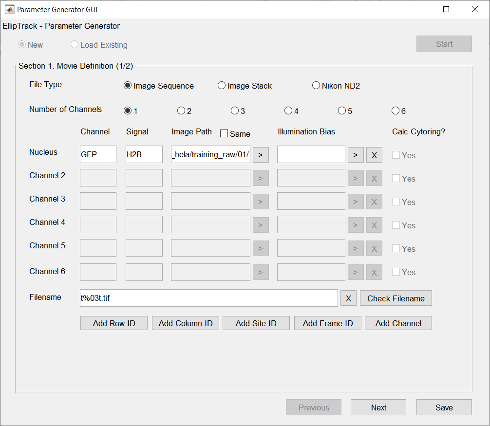

*  File Type --- Select "Image Sequences", since the movie was stored as an image sequence.
*  Number of Channels --- Select 1, since the movie has only one channel (H2B-GFP).
*  Channel --- Type "GFP".
*  Signal --- Type "H2B".
*  Image Path --- Click ">" to select the image folder.

   The text box will display ``Z:/projects/tracking_code/submission2/ctc_hela/training_raw/01/`` (or other paths in your local computer).
*  Illumination Bias --- Leave empty, since this information is not provided.
*  Filename --- Procedure: Type "t" in the text box; Click "Add Frame ID" and Type 3 in the pop-up text box; Type ".tif" in the text box. The result should be "t%03t.tif".

   Click "Check Filename" and the following message box appears. The input filename meets expectation.

   .. figure:: _static/images/tutorial/1_1_extra.png
      :align: center
      :width: 300

Movie Definition (2/2)
**********************

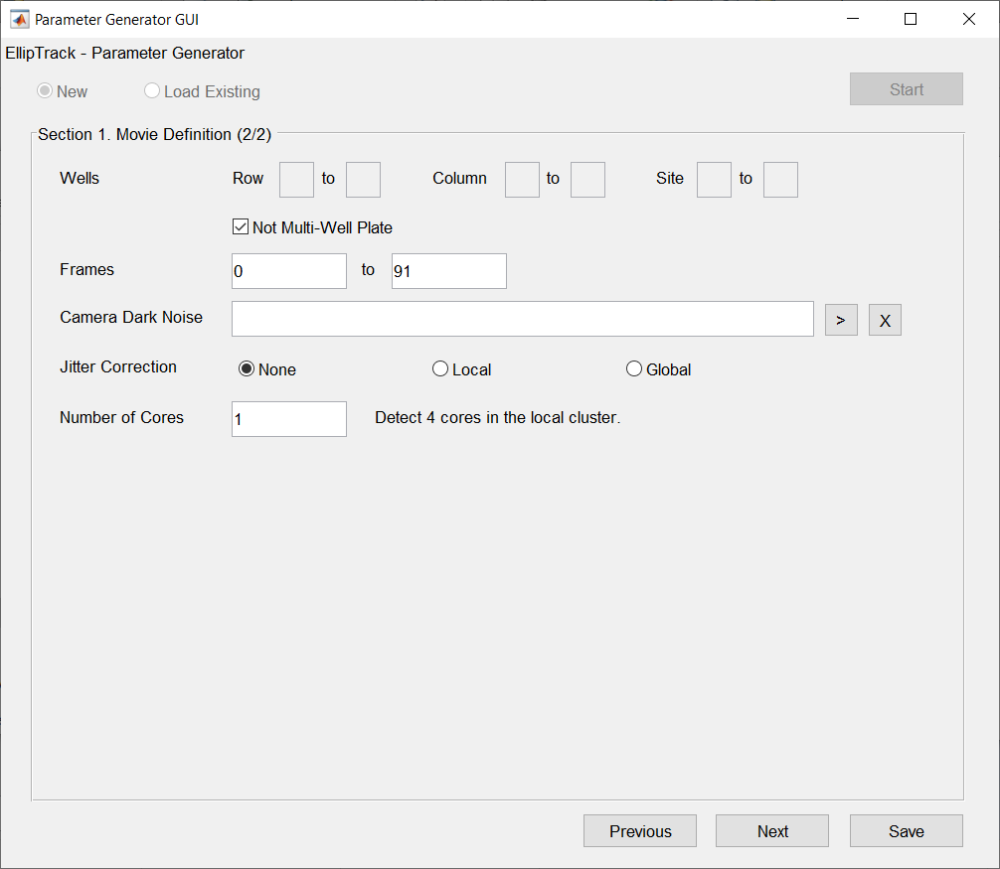

*  Wells --- Check "Not Multi-Well Plate", since the movie was not captured on a multi-well plate.
*  Frames --- Type 0 and 91.
*  Camera Dark Noise --- Leave empty, since this information is not provided.
*  Jitter Correction --- Select "None", since this step is not necessary.
*  Number of Cores --- Select 1, since there is only one movie to track.

Input/Output
************

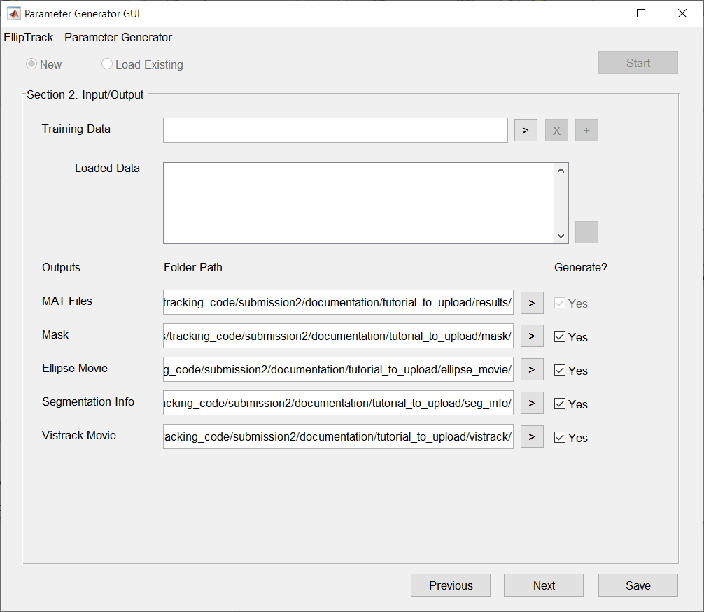

*  Training Data --- Leave empty, since no training datasets have been constructed for this movie.

   If training datasets have been constructed, load them here and skip Step 2 and Step 3 of this tutorial.
*  MAT Files --- Create a dedicated folder to store the output files. Click ">" to select this folder. 

   For example, we create a folder called *results* in the directory ``Z:/projects/tracking_code/submission2/documentation/tutorial_to_upload/`` to store the output files.
   After selecting this folder with the ">" button, the text box should display ``Z:/projects/tracking_code/submission2/documentation/tutorial_to_upload/results/``.

   Note that the *results* folder must be created manually. EllipTrack will not create this folder automatically.

*  Optional outputs.

   .. list-table:: 
      :widths: 1 2
      :header-rows: 1

      * - Output
        - Required?
      * - Mask
        - Optional
      * - Ellipse Movie
        - Optional
      * - Segmentation Info
        - Required for constructing training datasets.

          Optional otherwise.
      * - Vistrack Movie  
        - Optional

   To generate these files, check "Yes", create a dedicated folder for each output, and click ">" to select this folder. 
   Note that the dedicated folders must be created manually. EllipTrack will not create these folders automatically.

   For each output, all the files from the same movie will be stored in the same folder (*RowID_ColumnID_SiteID*). 
   For example, the files generated in this tutorial will be stored in the folder *1_1_1* under the directory specified in the GUI.
   To access these files (e.g. mask), go to the folder ``Z:/projects/tracking_code/submission2/documentation/tutorial_to_upload/mask/1_1_1/`` (or other paths in your local computer).

Segmentation
************

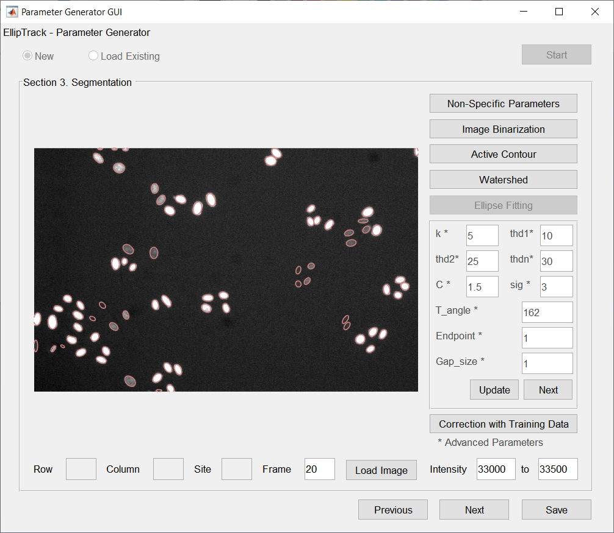

*  Load Image --- To examine Frame 20, type 20 in the "Frame" text box and click "Load Image".
*  Intensity --- Modify the values to 33000 and 33500 to visualize the dim cell nuclei.
*  Segmentation parameters --- Parameter values are determined as follows. Arrows are added outside of GUI to indicate the improvements.

   .. list-table::
      :widths: 2 2
      :header-rows: 1
      
      * - Segmentation Step
        - Result
      * - **Non-Specific Parameters**

          Areas are modified to reflect the morphology 
          
          of cell nuclei.

          * Nuc Area --- Modify to 50 to Inf.
          * Ellip Area --- Modify to 25 to Inf.
        - .. figure:: _static/images/tutorial/1_4_1.png
             :align: center
             :width: 300
      * - **Image Binarization**

          Due to the bright image background,

          *  Bg Sub --- Select "Min".

          Due to the heterogeneous brightness of cell nuclei, 

          *  Log-Transform --- Check.
          *  Method --- Select "Blob Detection".
          *  Blob Threshold --- Modify to -0.075, fine-tuned.
        - .. figure:: _static/images/tutorial/1_4_2.png
             :align: center
             :width: 300
      * - **Active Contour**

          To get more accurate nuclear boundaries,

          *  Run? --- Check.

          Due to the heterogeneous brightness of cell nuclei, 

          *  Log-Transform --- Check.
          *  Method --- Select "Local".

        - .. figure:: _static/images/tutorial/1_4_3.png
             :align: center
             :width: 300
      * - **Watershed**

          To separate the overlapping nuclei,

          *  Run? --- Check.

        - .. figure:: _static/images/tutorial/1_4_4.png
             :align: center
             :width: 300
      * - **Ellipse Fitting**

          Keep the default parameter values.

        - .. figure:: _static/images/tutorial/1_4_5.png
             :align: center
             :width: 300
      * - **Correction with Training Data**

          Since training datasets are not available,

          *  Run? --- Uncheck.

        - .. figure:: _static/images/tutorial/1_4_5.png
             :align: center
             :width: 300

   For **Ellipse Fitting**, all the parameters are advanced. It is often unnecessary to modify their values.
   
   If training datasets have been constructed, users may choose to run **Correction with Training Data**. 
   It is suggested to set "Min Prob" to a very high value (0.9 or above) to avoid modifying the ellipses with high uncertainties.

*  Examine the other images by typing their Frame IDs in the "Frame" text box and clicking "Load Images". Modify the parameter values if necessary. Repeat this process until segmentation is satisfactory.

Save Parameters
***************

Click "Save". File *parameters.m* is generated in the *GUI* folder. Replace the namesake in the main folder of EllipTrack (i.e. the parent folder of *GUI*) by this file.

Step 2. Run Segmentation
========================

Objective: Perform Segmentation.

*  Navigate MATLAB to the main folder of EllipTrack. Open *mainfile.m* in the MATLAB Editor.
*  Execute Line 1-14 (up to Segmentation). Procedure: Select these lines, right click the mouse, and select "Evaluate Selection".

   This process will take 30-60 min. *segmentation.mat* and other optional outputs will be generated in their respective folders.

Step 3. Construct Training Datasets
===================================

Objective: Construct training datasets from the movie.

Open Training Data GUI
**********************

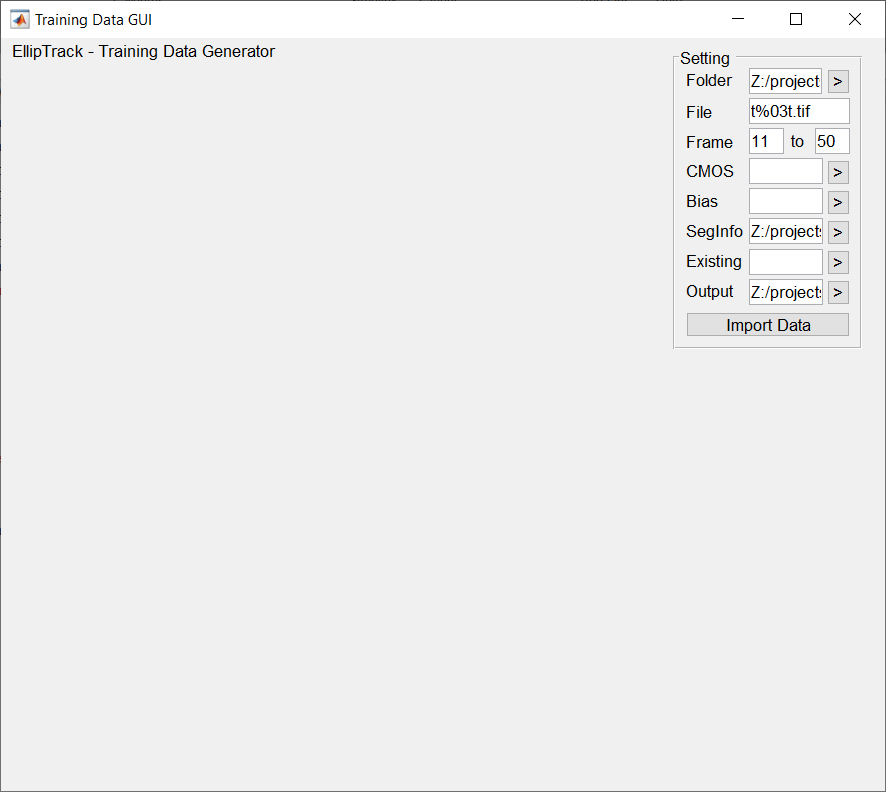

*  Navigate MATLAB to the *GUI* folder. Execute ``training_data_gui`` in the command window.
*  Specify the following information in the Setting panel.

   To construct a new training dataset from Frame 11 to Frame 50, follow the procedure.

   *  Folder --- Click ">" and select the folder where the images of the nuclear channel locate.
   
      The text box will display ``Z:/projects/tracking_code/submission2/ctc_hela/training_raw/01/`` (or other paths in your local computer).

   *  File --- Type "t%03t.tif", the format of image filenames.

      Only Frame ID (%t) is allowed as variable information here. Other information, such as Row ID and Channel Name, should be explicitly specified.

   *  Frames --- Type 11 and 50.
   *  CMOS --- Leave empty, since this information is not provided.
   *  Bias --- Leave empty, since this information is not provided.
   *  SegInfo --- Click ">" and select the folder where the "Segmentation Info" files locate.

      The text box will display ``Z:/projects/tracking_code/submission2/documentation/tutorial_to_upload/seg_info/1_1_1/`` (or other paths in your local computer).

   *  Existing --- Leave empty, since the objective is to create a new training dataset.

      If the objective is to modify an existing training dataset, specify its location here.

   *  Output --- Click ">" and select the output folder.
*  Click "Import Data" to import the images.

Morphological Training
**********************

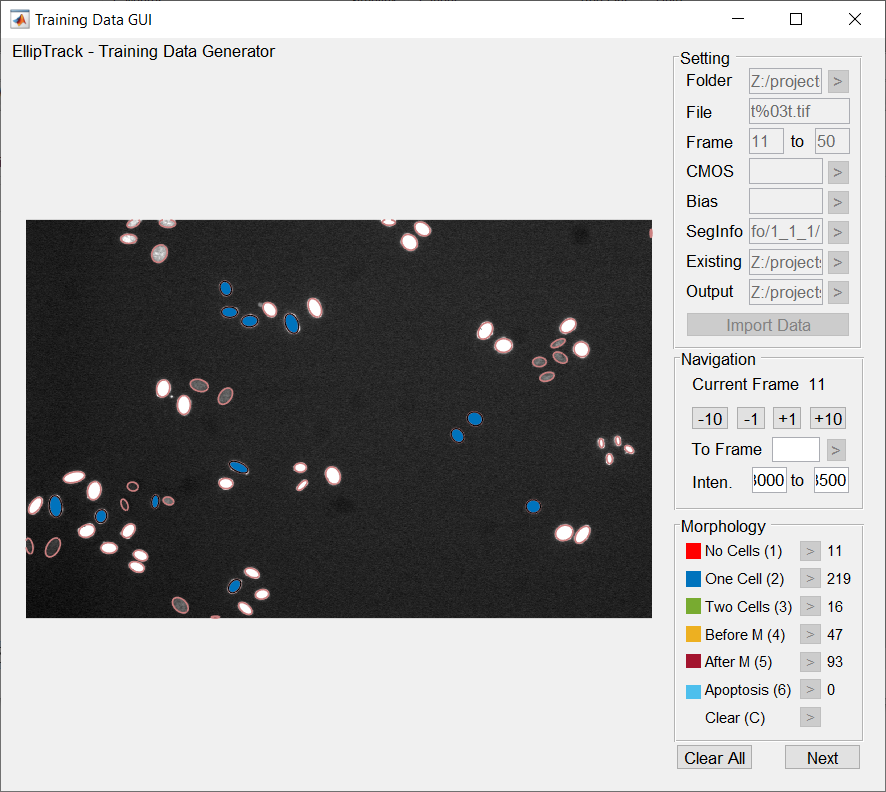

*  Intensity --- Modify to 33000 and 33500 to visualize the dim cell nuclei.
*  Construct training samples.

   A new training sample can be constructed by clicking an ellipse of interest and specifying its event (click ">" next to the event or press the hotkey specified in the parentheses).
   To correct or remove a trained ellipse, click the ellipse of interest, and specify a new event (correct) or clear the event (remove).

*  Navigate between frames to construct samples from other frames.

   .. list-table::
      :widths: 1 2
      :header-rows: 1

      * - Option
        - Operation
      * - Forward by 1 Frame
        - Click "+1" button, press right arrow key, 
         
          or scroll down the mouse wheel.
      * - Backward by 1 Frame
        - Click "-1" button, press left arrow key,

          or scroll up the mouse wheel.
      * - Forward by 10 Frames 

        - Click "+10" button, or press up arrow key.
      * - Backward by 10 Frames

        - Click "-10" button, or press down arrow key.

*  After constructing training samples, click "Next" to proceed.

   Around 400 samples are constructed here. 
   The sample numbers of :training1:`No Cells`, :training2:`One Cell`, and :training3:`Two Cells` approximately reflect the accuracy of segmentation.
   Most mitosis events (:training4:`Before M` and :training5:`After M`) are trained. No :training6:`Apoptosis` events are trained, as cell apoptosis is rare in the movie.
   These samples cover the broad spectra of cell morphology, brightness, and behaviors.

   **Minimal Requirement**. Label one ellipse. Can be any event.

Motion Training
***************

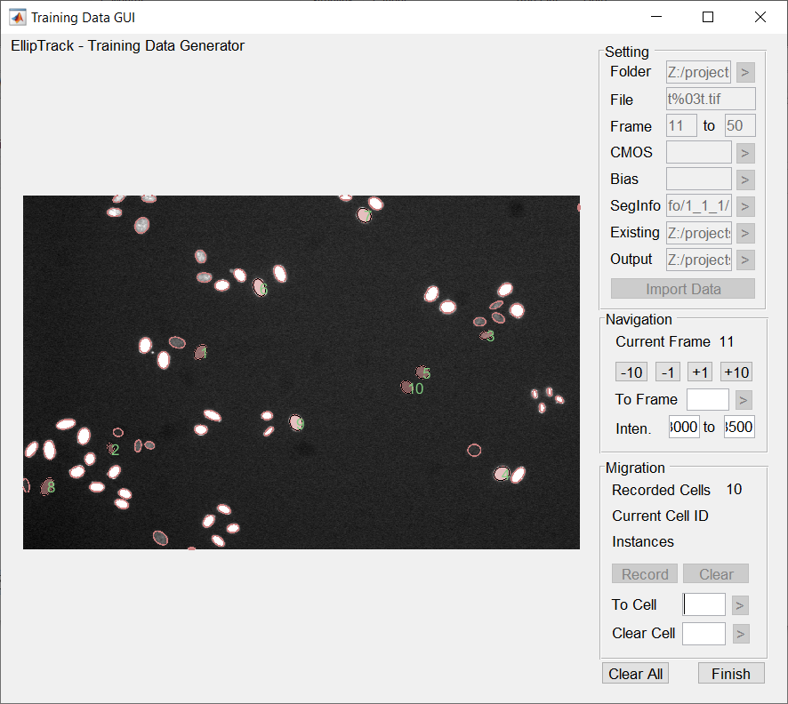

*  Manually label a few cell tracks.

   To label a cell track, specify a new Cell ID in the "To Cell" text box and click ">". 
   Label a cell's appearance in every frame by clicking its respective ellipse and clicking "Record" (or pressing the "R" hotkey).
   To remove a labeled ellipse, click the ellipse of interest and then click "Clear" (or press the "C" hotkey).
   To remove a cell track, specify its Cell ID in the "Clear Cell" text box and click ">".

   10 cells are labeled for this movie. These cells cover the broad spectra of cell morphology, brightness, and behaviors.

   **Minimal Requirement**. Label 3 cells. 3 ellipses per cell.

Save Training Dataset
*********************

Click "Finish". File *training_data_11_50.mat* will be generated in the output folder. 

Since this movie is short, only one training dataset is constructed. For large-scale movies, repeat this process to construct additional ones.
In principle, a training dataset should be constructed from every representative segment of the movie.

Step 4. Set Parameter Values (2/2)
==================================

Open Parameter Generator GUI
****************************

*  Navigate MATLAB to the *GUI* folder. Execute ``parameter_generator_gui`` in the command window.
*  Load the previous parameter file: Select "Load Existing", and click ">" to locate the file.
*  Click "Start" to import the parameter values.

Input/Output
************

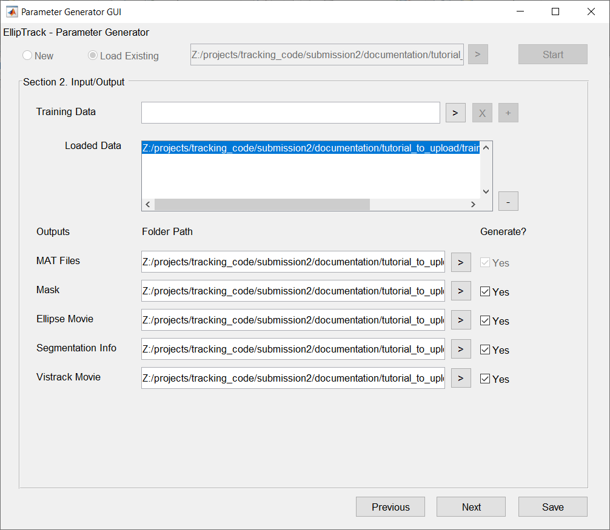

*  Training Data --- Click ">" to locate the training dataset constructed in Step 3, and then click "+" to add it to the list of loaded datasets.

   Loaded Data will display 
   
   .. code-block:: matlab
   
      Z:/projects/tracking_code/submission2/documentation/tutorial_to_upload/training_data/training_data_11_50.mat 
   
   or other paths in your local computer.

Prediction of Events (1/2)
**************************

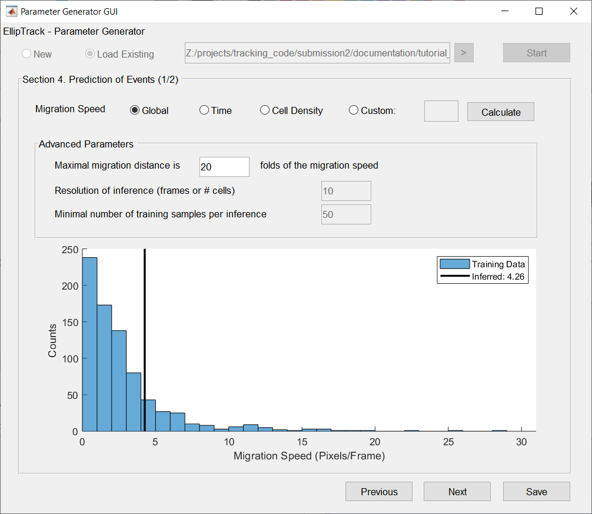

*  Migration Speeds --- Select "Global", as no clear trend between the migration speeds and time/density is observed.

   .. list-table::
      :widths: 1 5
      :header-rows: 1

      * - Option
        - Inference Result
      * - **Global**
        - .. figure:: _static/images/tutorial/4_1_1.png
             :align: center
             :width: 500
      * - **Time**
        - .. figure:: _static/images/tutorial/4_1_2.png
             :align: center
             :width: 500
      * - **Density**
        - .. figure:: _static/images/tutorial/4_1_3.png
             :align: center
             :width: 500

   Note that the inference result is training dataset-dependent. These results are obtained with the dataset provided in the `Google Drive folder`_. 

Prediction of Events (2/2)
**************************

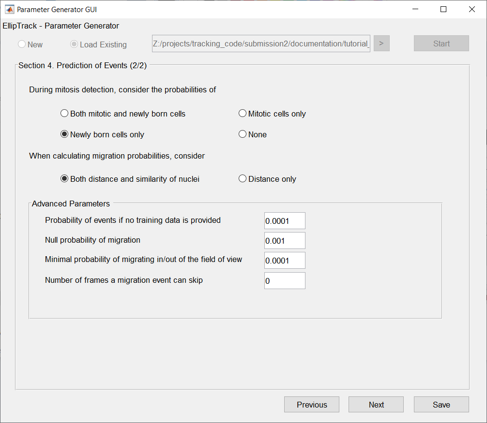

Keep the default values.

Track Linking
*************

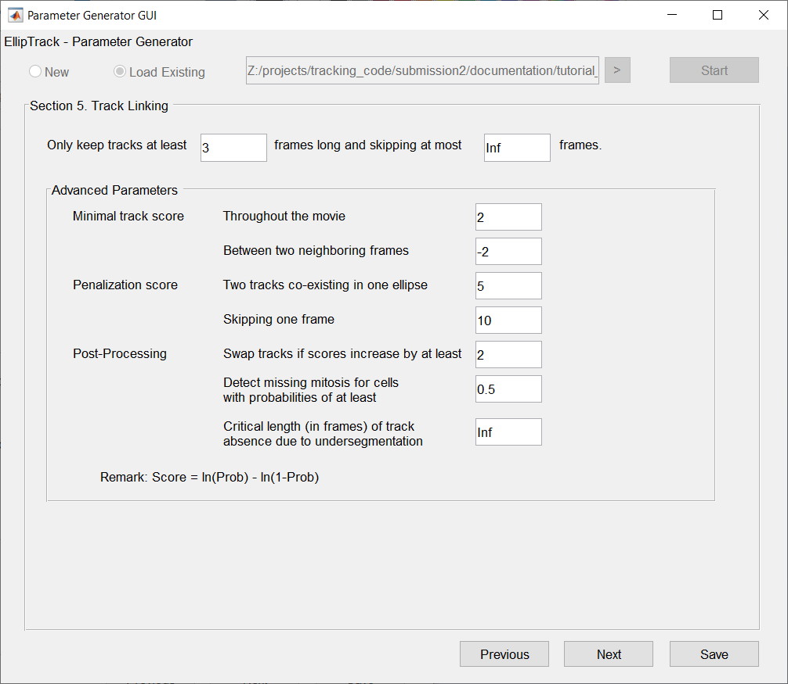

*  Tracks to Keep --- Modify to 3 and Inf.
*  Post-Processing, Critical Length -- Modify to Inf.

   The default values of these parameters are often sufficient for a satisfactory tracking performance. 
   For this movie, these values are specifically adjusted to improve the mitosis detection. 

Note: "Post-Processing" has been renamed as "Local Track Correction" in the newer versions.

Signal Extraction
*****************

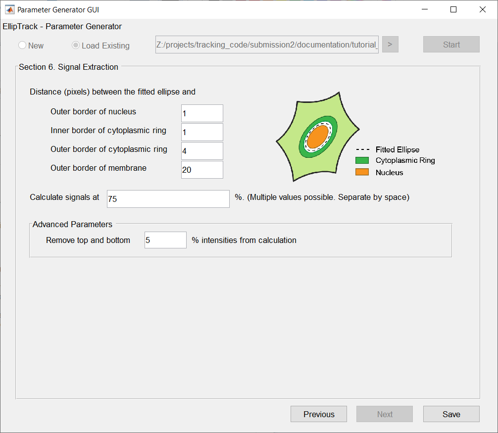

Keep the default values.

Save Parameters
***************

Click "Save". File *parameters.m* will be generated in the *GUI* folder. Replace the namesake in the main folder of EllipTrack (i.e. the parent folder of *GUI*) by this file.

Step 5. Run Track Linking and Signal Extraction
===============================================

Objective: Perform Track Linking and Signal Extraction.

*  Navigate MATLAB to the main folder of EllipTrack. Open *mainfile.m* in the MATLAB Editor.
*  If Segmentation has not been performed (Step 2-3 have been skipped), execute *mainfile.m*.
*  Otherwise, load the segmentation results into the workspace.

   * Replace Line 13 (Segmentation) by 

     .. code-block:: matlab

        load([inout_para.output_path, 'segmentation.mat']);

   * Execute *mainfile.m*.

   This process will take 10-20 min. MAT files (*jitters.mat*, *probabilities.mat*, *tracks.mat*, and *signals.mat*) and vistrack movies will be generated in their respective folders.

.. _`Google Drive folder`: https://drive.google.com/drive/folders/17fcwM5JPtW-3TwuIXiTt5tSrz7c8StLj
.. _`here`: http://data.celltrackingchallenge.net/training-datasets/Fluo-N2DL-HeLa.zip
